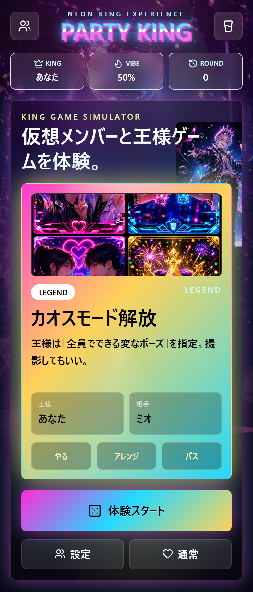
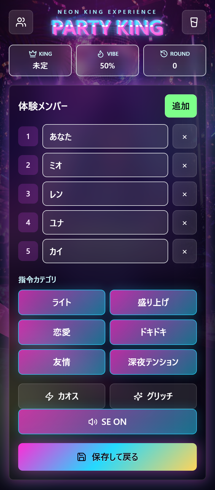
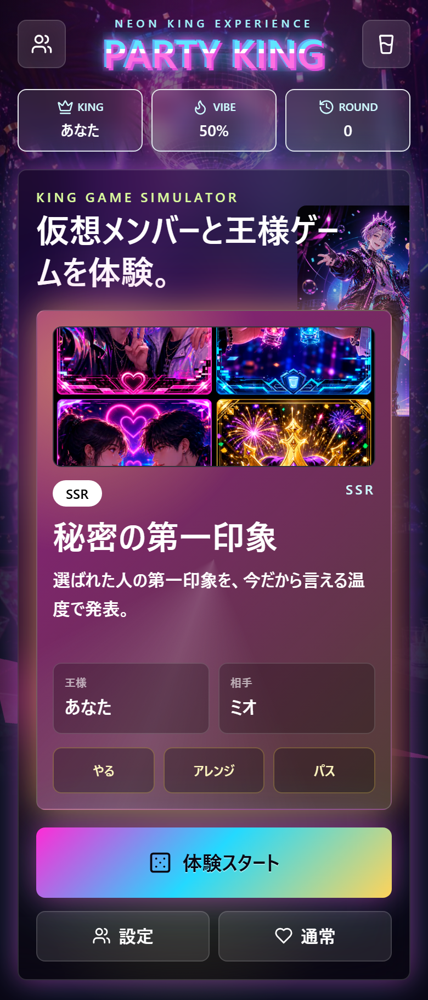

# PARTY KING

仮想メンバーと一緒に「王様ゲームの空気」を体験できる、ネオン系シミュレーションゲームです。実際の飲み会で使う補助ツールではなく、1人でも王様決定、指令カード、リアクション選択、盛り上がりスコアを楽しめるゲーム体験を狙っています。

## Demo URL

GitHub Pages公開後にここへURLを入れます。

https://jim-auto.github.io/party-king-game/

## Screenshot

| Home / Reveal | Setup | SSR |
| --- | --- | --- |
|  |  |  |

## Concept

- 日本の王様ゲーム文化と海外パーティゲームUIのミックス
- 深夜バラエティ、恋愛リアリティショー、ソシャゲ演出の空気感
- ネオン、カクテル、グリッチ、カオス、SSR演出
- 仮想メンバーと遊んでいるようなラウンド進行
- 「やる / アレンジ / パス」のリアクション選択
- 露骨な成人向け表現は避け、SNSに載せやすい安全なパーティ感を優先

## Features

- React + TypeScript + Vite
- Tailwind CSS
- Framer Motionによるカード出現、爆発パーティクル、ヌルっとした操作感
- プレイヤー名、カテゴリ、モードをlocalStorageに保存
- 王様、対象プレイヤー、指令カードをランダム決定
- ライト、盛り上げ、恋愛、ドキドキ、友情、深夜テンションのカテゴリ
- ラウンド数、盛り上がりスコア、リアクション履歴
- SSR / LEGEND / 深夜2時モード / グリッチ演出 / カオスモード
- GitHub Pages対応の相対パスビルド
- PWA化しやすいmanifestとservice workerの土台
- AI生成素材を`public/assets/ai/`に配置

## AI Generated Assets

このアプリはAI生成ビジュアル前提の構成です。現在は以下の素材を同梱しています。

- `public/assets/ai/neon-party-bg.png`
- `public/assets/ai/party-king-host.png`
- `public/assets/ai/command-card-sheet.png`
- `public/assets/ai/effects-sticker-sheet.png`

アプリ上では軽量化したWebP版を優先して参照しています。PNGは元素材として残しています。

追加・差し替え用のプロンプトは`prompts/`に用途別で整理しています。

- `prompts/backgrounds.md`
- `prompts/characters.md`
- `prompts/cards.md`
- `prompts/ui.md`
- `prompts/effects.md`

Stable Diffusion、Midjourney、GPT Image系で使える英語プロンプトを入れているため、生成した素材を`public/assets/ai/`へ追加すれば、カードアートや背景を拡張できます。

## Development Philosophy

最初の画面から「王様ゲームを体験している」ことを優先しています。説明ページではなくゲーム画面を出し、王様決定、指令、リアクション、盛り上がり変化が短いループで回るようにしています。

指令は盛り上がる一方で、強制や露骨な性的表現に寄せすぎない方針です。パスやアレンジをゲーム内リアクションとして扱い、嫌な命令を実行するゲームにならないようにしています。

## Directory

```txt
.
├─ public/
│  ├─ assets/ai/        # AI生成素材
│  ├─ manifest.webmanifest
│  └─ sw.js
├─ prompts/             # 画像生成プロンプト集
├─ src/
│  ├─ components/
│  ├─ data/
│  ├─ App.tsx
│  ├─ lib.ts
│  ├─ main.tsx
│  └─ styles.css
├─ index.html
├─ vite.config.ts
└─ package.json
```

## Setup

```bash
npm install
npm run dev
```

## Screenshots

README用スクリーンショットはPlaywrightで生成できます。ローカルサーバーを起動してから実行します。

```bash
npm run dev -- --port 5174
SCREENSHOT_URL=http://localhost:5174/ npm run screenshots
```

Windows PowerShellの場合:

```powershell
$env:SCREENSHOT_URL='http://localhost:5174/'
npm run screenshots
```

## Build

```bash
npm run build
```

AI生成素材を差し替えた場合は、WebP版を再生成します。

```bash
npm run optimize:assets
```

`dist/`がGitHub Pagesで配信する静的ファイルです。`vite.config.ts`で`base: './'`にしているため、`https://user.github.io/party-king-game/`のようなサブパスでも動作します。

## GitHub Pages Deploy

GitHub Pagesへは2通りで公開できます。

### gh-pagesブランチで公開

1. `npm run build`で`dist/`を作ります。
2. `dist/`の内容を`gh-pages`ブランチへpushします。
3. GitHubの **Settings > Pages > Build and deployment > Source** を `Deploy from a branch` にします。
4. Branchを `gh-pages`、Folderを `/ (root)` にします。
5. 公開URLをREADMEのDemo URL欄へ追記します。

### GitHub Actionsで公開

Actionsを使う場合は、`docs/github-actions-deploy.yml`を`.github/workflows/deploy.yml`へコピーしてpushします。

注意: GitHubトークンに`workflow`スコープがない環境では、workflowファイルをpushできません。その場合は`gh-pages`ブランチ公開を使います。

手元で確認する場合:

```bash
npm run lint
npm run build
```

## Future Ideas

- 指令カードの追加パック
- 生成AIによるその場の指令生成
- NPCごとの性格、好感度、イベント分岐
- プレイヤーごとの称号・勝手にランキング
- カードごとの専用AIイラスト
- オフライン完全対応の強化
- 画像素材のWebP最適化
- SE実装とバイブレーション演出
- エンディング、実績、周回モード
